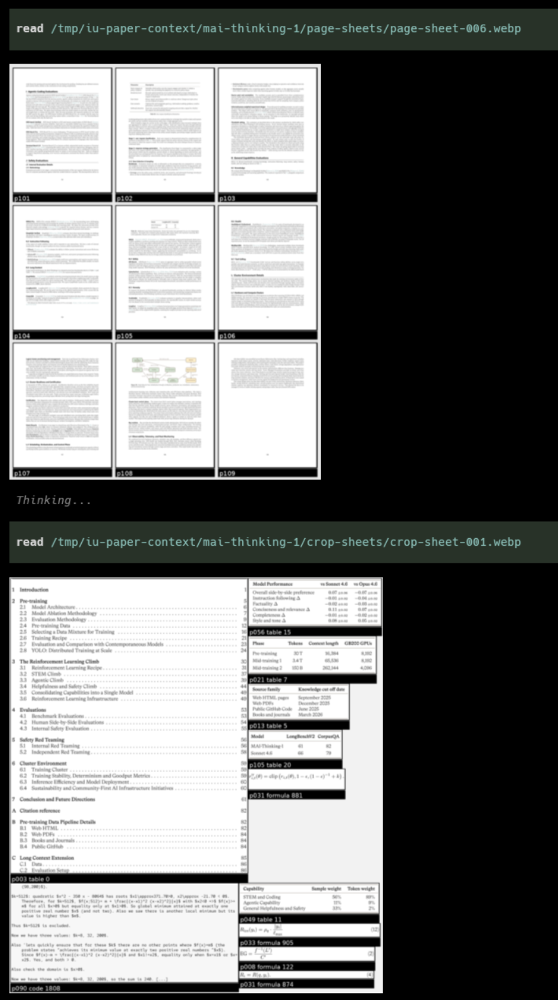
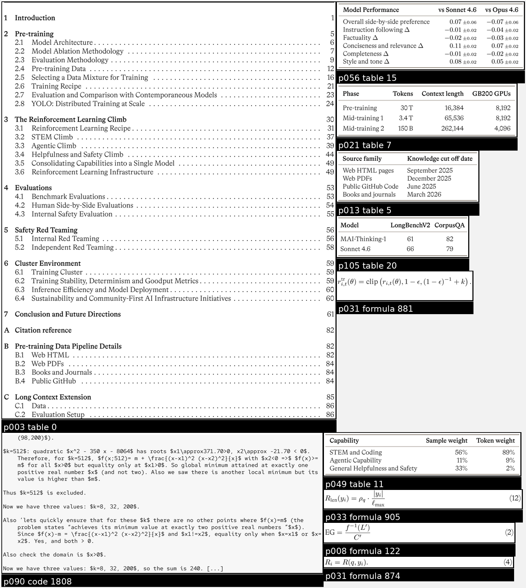
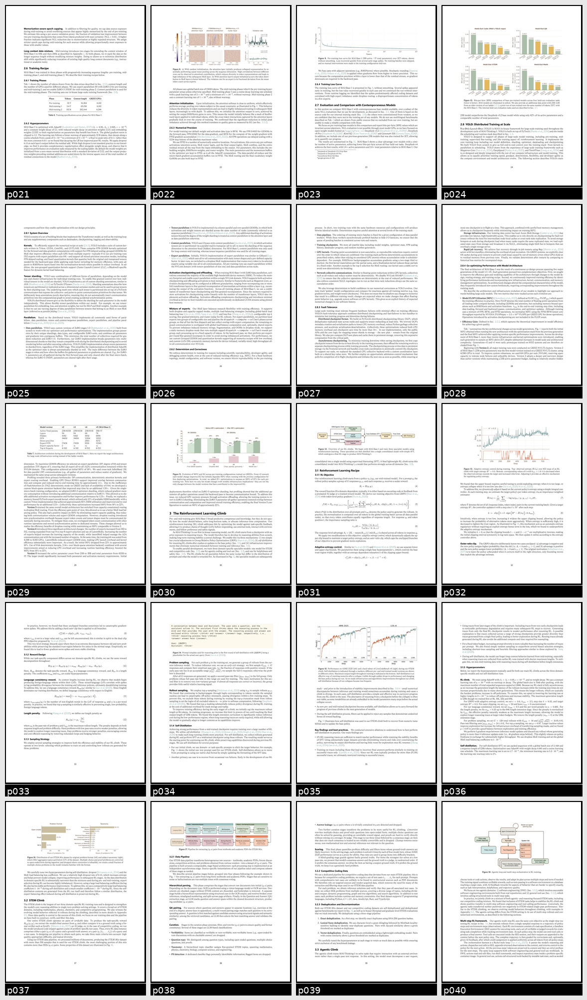

# interactive-understanding

A skill for reading visually rich PDFs with a terminal agent. It uses Docling to build a local context pack: extracted text, page overview sheets, figure/table/equation/code crops, manifests, and discussion notes so the agent can answer from the paper instead of lossy PDF text alone.

## How it works

Runs `iu-context-pack` on a PDF. It exports reading-order text, page images, visual crops, crop sheets, page overview sheets, and a manifest that ties everything back to pages and coordinates.

In a terminal agent, use `skill:interactive-understanding link-or-pdf-file` to process the PDF and load the text and sheets into agent context. The agent can then answer from both the extracted text and visual evidence, while Q&A, further reading, and working notes keep the discussion recoverable across context resets.

## Example outputs

Pi using the loaded paper context:

A crop sheet of detected figures, tables, equations, and code blocks:

A page overview sheet for quick layout scanning:

